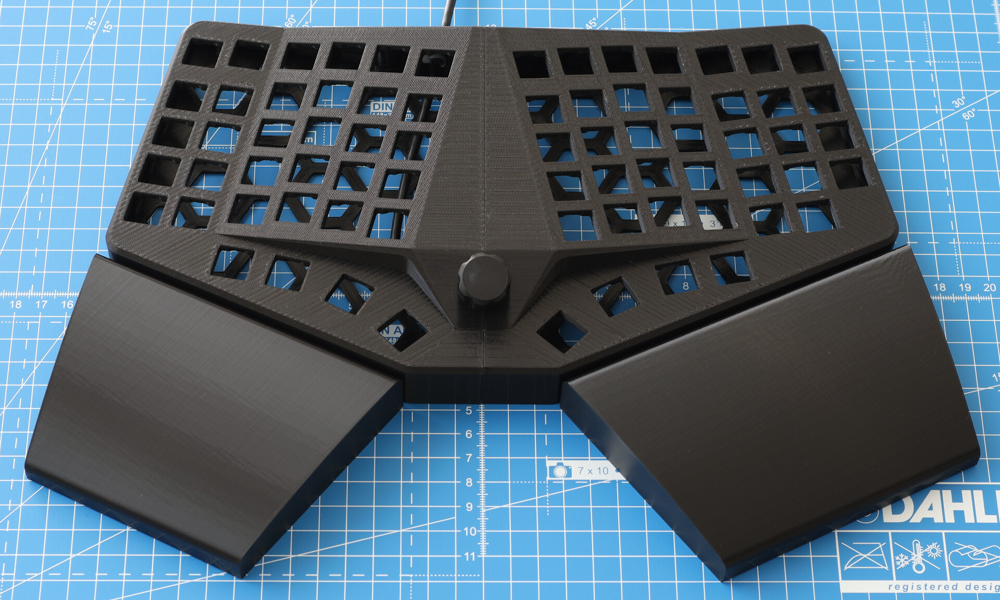
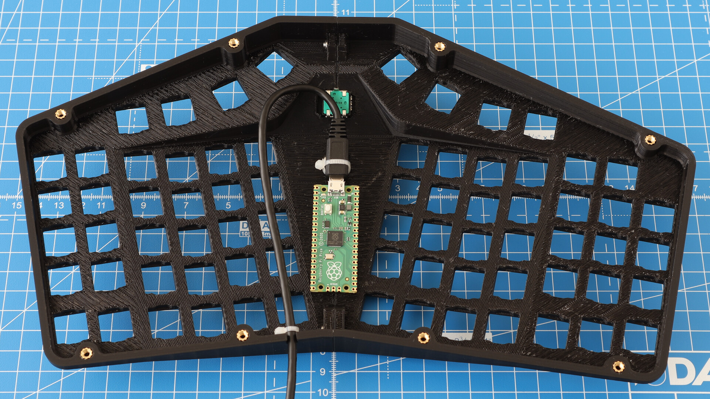
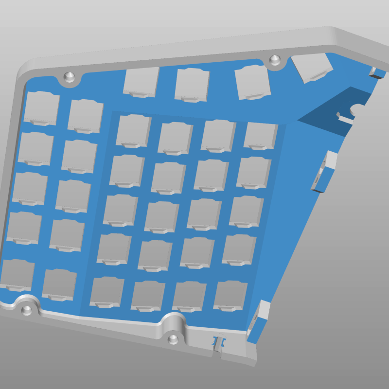
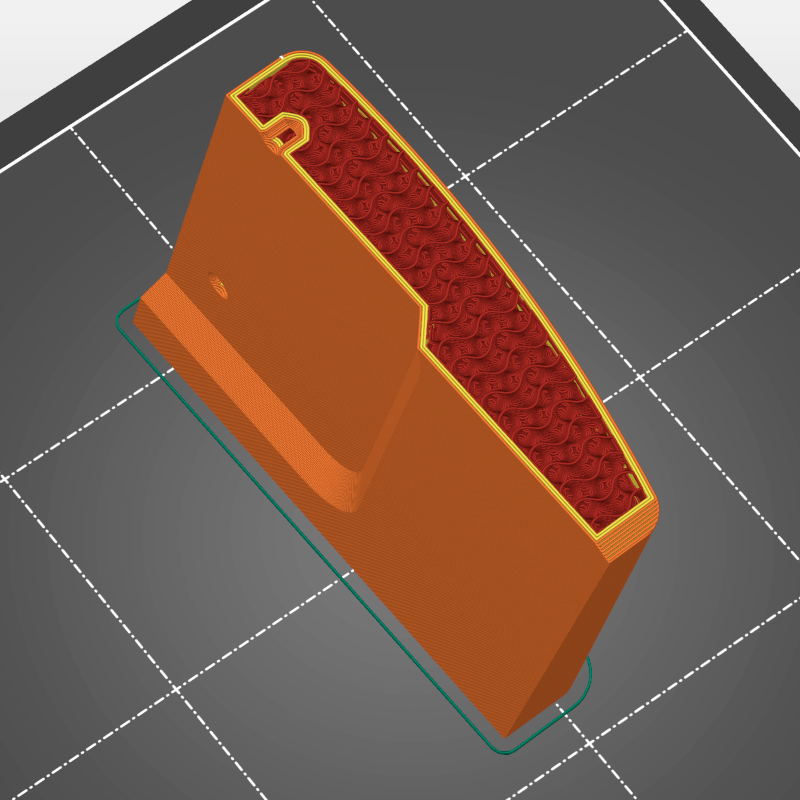
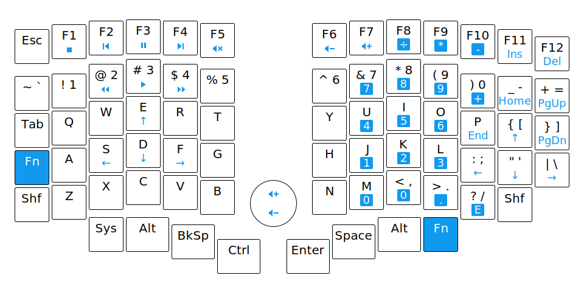
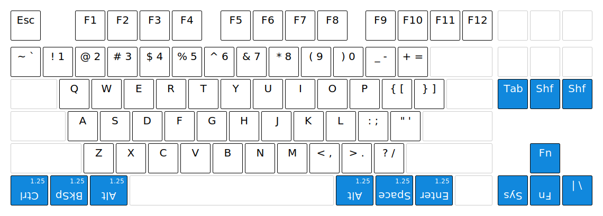

Chrumm keyboard
===============

Chrumm is an ergonomic keyboard prototype, influenced by many
open hardware projects of the mechanical keyboard community,
including the [Ergodox], [Dactyl], [Sofle], [Pteron],
and the works of [Bastardkb].

The default STL files can be downloaded from the [releases] page.

**Important:** This project is not yet complete.
A PCB and new firmware is in the works.
The default configuration may change.

[Ergodox]: https://www.ergodox.io/
[Dactyl]: https://github.com/adereth/dactyl-keyboard
[Sofle]: https://github.com/josefadamcik/SofleKeyboard
[Pteron]: https://github.com/FSund/pteron-keyboard
[Bastardkb]: https://bastardkb.com/
[releases]: https://github.com/sevmeyer/chrumm-keyboard/releases
[firmware]: https://github.com/sevmeyer/chrumm-firmware

Features
--------

- Reasonably standard layout
- Columnar stagger
- Integrated split, tent, and tilt angles
- Separate tenting for fingers, pinky, and thumb
- Narrow size to make room for the mouse
- Firmly attached palm rests
- Single body and controller
- Central rotary encoder
- Designed for FFF 3D printing
- Parametric construction with Python

Printing
--------

I sliced the parts with [PrusaSlicer] and printed them on
a Prusa Mini+ with PLA filament. Check the prusa directory
for the configuration files. Other printers and filaments
may require different settings.

[PrusaSlicer]: https://www.prusa3d.com/prusaslicer/

#### Body

The body requires supports on the underside of the key plates,
split brackets, encoder, and cable hook. The switch notches
should print fine without supports.

- Layer height: 0.15mm
- Perimeters: 2
- Solid layers: 5 bottom, 5 top
- Infill: 15% rectilinear
- Aligned rectilinear top infill (looks nice)

#### Floor

- Layer height: 0.2mm
- Perimeters: 2
- Solid layers: 4 bottom, 6 top
- Infill: 15% rectilinear

#### Palm rests

The palm rests should be printed sideways, with their inward
side on the printbed. This ensures that the curved top shell
is as smooth and robust as possible.

- Layer height: 0.2mm
- Perimeters: 3
- Solid layers: 4 bottom, 0 top (rely on overlapping perimeters)
- Infill: 15% gyroid (omnidirectional strength)

#### Encoder knob

The encoder knob is printed upside down. It should be solid,
without infill, to evenly distribute torsional stress.

- Layer height: 0.15mm
- Perimeters: 99

Assembly
--------

Electronic parts:

- 72x MX compatible switch
- 1x EC11 rotary encoder, 12.5x13.2mm, 15mm flatted shaft (D shape), M7 nut mount
    - Bourns PEC11R-4215F-N0024  (24 detents)
    - Bourns PEC11R-4115F-N0018  (18 detents)
    - Bourns PEC11R-4015F-N0024  (no detents)
    - ...

Assembly parts:

- 12x Heat set insert, M3, 4mm length (not longer)
- 12x Countersunk head screws, ISO 10642, M3, 6mm length
- Zip ties, 2mm width, 1mm thick
- Anti-slip rubber feet or foam layer

Additional parts if the body is split:

- 5x Nylon insert locknut, ISO 10511, M3
- 5x Button head screws, ISO 7380-1, M3, 8mm length

Note that the tenting of the body makes it difficult
to reach the button head screws in a straight line.
Use a ball-point driver, or a short-armed key.

Layout
------

For the thumb clusters, I recommend upside-down, 1.25u,
bottom-row caps from a cylindrical profile (Cherry, OEM).
With a bit of improvisation, the caps can be sourced from
a single tenkeyless (TKL) set:

