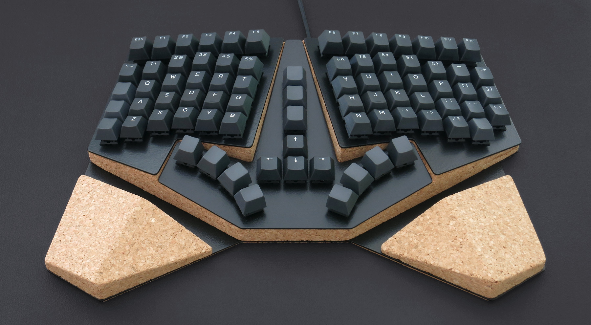
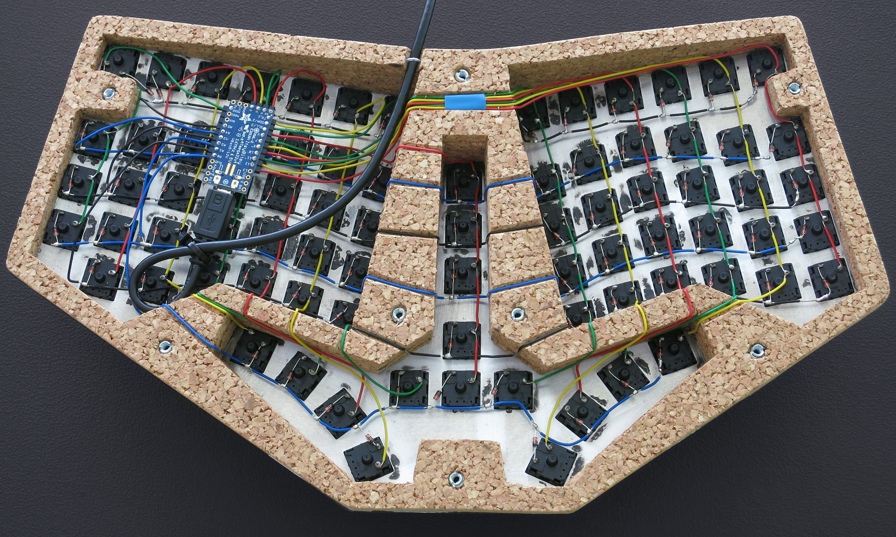
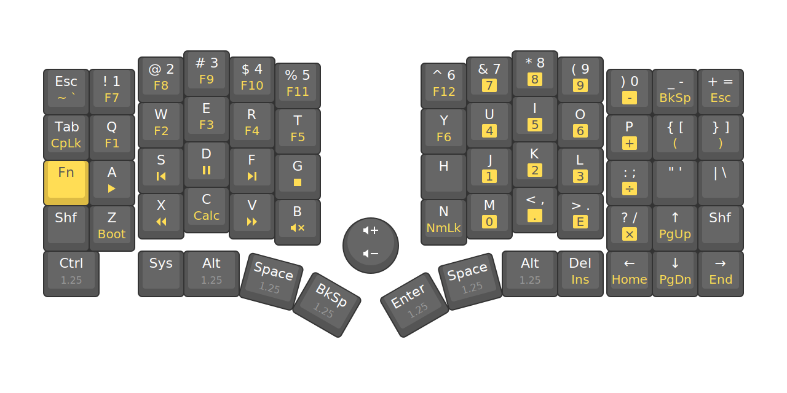
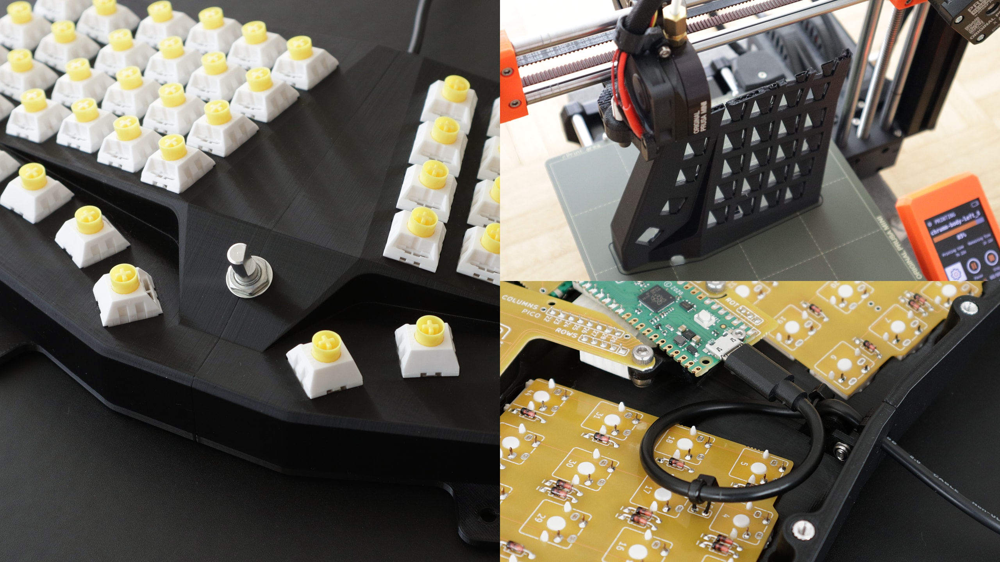
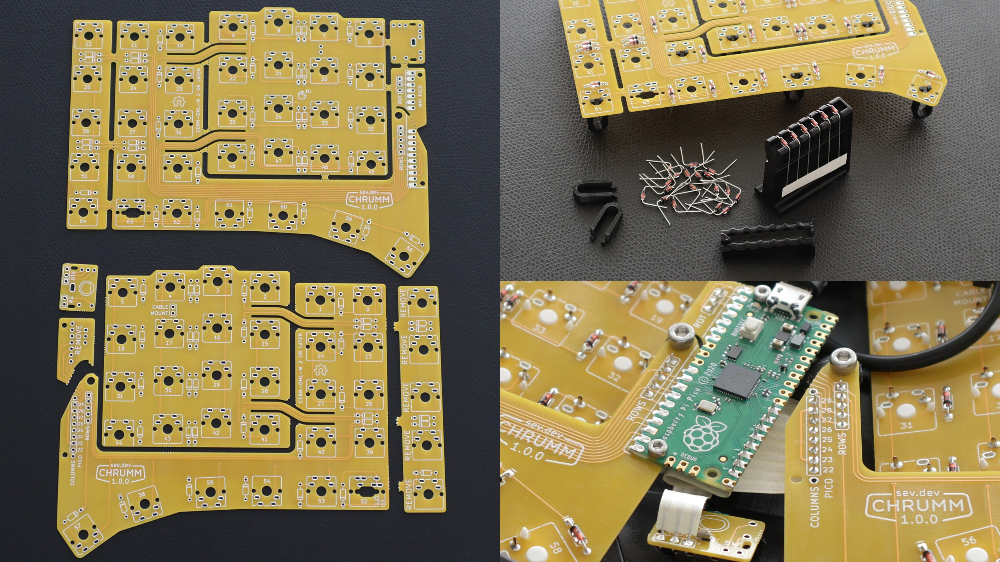

Chrumm keyboard
===============

Chrumm is an open-hardware ergonomic keyboard,
made of a 3D-printable body, a bendable PCB,
and custom firmware for the Raspberry Pi Pico.

This repository contains all relevant source files.
I share these files in the hope that they are useful, or
at least interesting to others. Keep in mind that this is
a free, do-it-yourself project. What you see is what you get.
Make sure to check the license.

Files
-----

- [Releases] - Download page for STL, 3MF, GBR, UF2 files
- [BUILD.md](BUILD.md) - Build instructions
- [MATERIALS.md](MATERIALS.md) - Bill Of Materials
- [pcb/README.md](pcb/README.md) - PCB production details
- [body/README.md](body/README.md) - Body generator parameters
- [firmware/README.md](firmware/README.md) - Firmware overview and installation

[Releases]: https://github.com/sevmeyer/chrumm-keyboard/releases/

Features
--------

Chrumm features a column staggered layout with simple thumb clusters.
The right side has an additional column, to better approximate
the standard ANSI layout, and to provide dedicated arrow keys.
A central encoder allows for rotational input.

The body is a robust monoblock without visible screws. It has
integrated split, tent, and tilt angles, similar to commercial
ergonomic boards. The palm rests and the USB cable are firmly
attached, so that everything can be moved around without hassle.

The STL files are generated programmatically, with a pure
Python package that has no dependencies. They are optimized
for FFF 3D printing. Most parts are printed sideways, to
produce a smooth surface without the need of post-processing.
Custom supports minimize the print time and filament cost.

The body houses two reversible, bendable, interconnected PCBs.
They are powered by a Raspberry Pi Pico.

Layout
------

Credit
------

Chrumm would not exist without the shared knowledge of the
mechanical keyboard community.

I found inspiration on [Reddit], [KBD.news], [geekhack], and
learned a lot from the [PCB guides] by ai03 and Ruiqi Mao, the
[Keyboard posts] by Masterzen, and the [Matrix Help] by Dave Dribin.

The layout and body is influenced by projects like the [Ergodox],
[Dactyl], [Sofle], [Pteron], and everything from [Bastardkb].
I also used established open hardware repositories for reference,
including the [UHK60], [Skeletyl], [Sofle], [Corne], and [Torn].

[Reddit]: https://old.reddit.com/r/ErgoMechKeyboards+MechanicalKeyboards/
[KBD.news]: https://kbd.news/
[geekhack]: https://geekhack.org
[PCB guides]: https://wiki.ai03.com/books/pcb-design
[Keyboard posts]: https://www.masterzen.fr/tag/#mechanical-keyboards
[Matrix Help]: https://www.dribin.org/dave/keyboard/one_html/
[Ergodox]: https://www.ergodox.io/
[Dactyl]: https://github.com/adereth/dactyl-keyboard
[Sofle]: https://github.com/josefadamcik/SofleKeyboard
[Pteron]: https://github.com/FSund/pteron-keyboard
[Bastardkb]: https://bastardkb.com/
[UHK60]: https://github.com/UltimateHackingKeyboard/uhk60v1-electronics
[Skeletyl]: https://github.com/Bastardkb/Skeletyl-PCB-plate
[Corne]: https://github.com/foostan/crkbd
[Torn]: https://github.com/rtitmuss/torn

Gallery
-------

