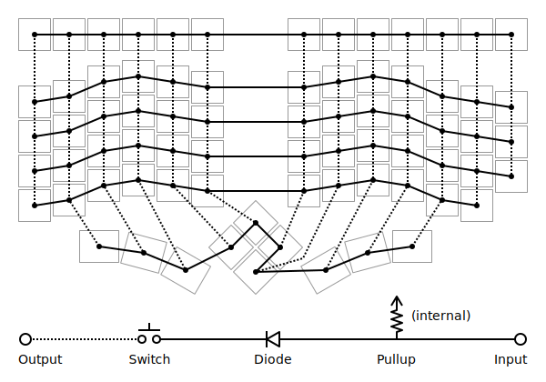
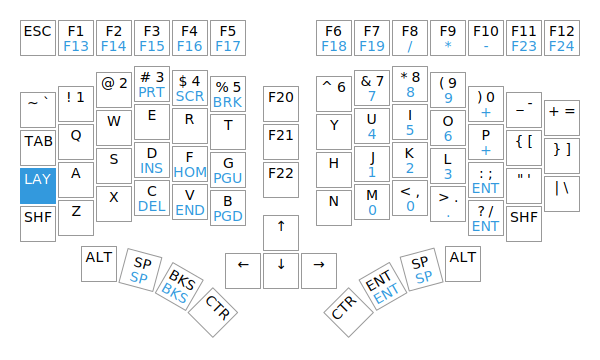
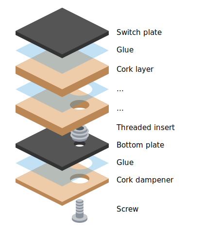

Chrumm keyboard
===============

Chrumm is an ergonomic keyboard prototype, influenced by
projects like the [Ergodox], [Redox], [Dactyl], and [Pteron].
For more information, check out the [build log].

Chrumm is provided without warranty of any kind.
It is your own responsibility to fulfill all
applicable health and safety requirements.

- Fixed-split layout
- Columnar stagger
- Tenting
- Tilted thumb clusters
- Integrated palm rests
- Decent dampening
- Reasonably close to ANSI
- Dedicated function key row

[build log]: https://sev.dev/hardware/making-chrumm-keyboard/
[Ergodox]: https://www.ergodox.io/
[Redox]: https://github.com/mattdibi/redox-keyboard
[Dactyl]: https://github.com/adereth/dactyl-keyboard
[Pteron]: https://github.com/FSund/pteron-keyboard

Electronics
-----------

The [firmware] is maintained in a separate repository.
The electronics are hand-wired. I mostly followed existing guides,
see the [QMK Hand-Wiring Guide] for a good overview. In particular,
I learned about the importance of the diodes from [Dave Dribin].
I used the following materials, based on availability,
affordability, and personal preference:

- Aluminium plates, 1.5mm
- 79x Key switch (Cherry MX Silent Red)
- 79x Key cap, 1U (Cherry MX profile)
- 79x Diode, 1N4148
- Insulated solid wire, 0.5mm (24AWG), tinned copper
- Solder (Stannol Kristall 600, Sn96.5Ag3Cu0.5, REL0, 0.5mm)
- [Adafruit ItsyBitsy 32u4 5V 16MHz]
- USB cable, A to micro-B

[QMK Hand-Wiring Guide]: https://github.com/qmk/qmk_firmware/blob/master/docs/hand_wire.md
[Dave Dribin]: https://www.dribin.org/dave/keyboard/one_html/
[Adafruit ItsyBitsy 32u4 5V 16MHz]: https://www.adafruit.com/product/3677
[firmware]: https://github.com/sevmeyer/chrumm-firmware

Body
----

The body is made out of cork layers, with the goal to dampen
vibrations and to decouple the top plates from the bottom.
The layers are manually cut, glued, and sanded.
The `tools` directory includes a Python script to slice the
STL files into layer outlines, which can be printed on paper.
It should be possible to adapt the body for 3D printing or CNC milling,
but that will increase its cost and limit the choice of materials.
Note that the STL model does not yet include wire channels.

- Cork sheets
- Sandpaper, P120 for shaping, P180 for smoothing
- Flexible glue (UHU Max Repair Universal)
- 12x Threaded insert, DIN 7965, M3, 8mm
- 12x Button head screw, ISO 7380, M3, 8mm

