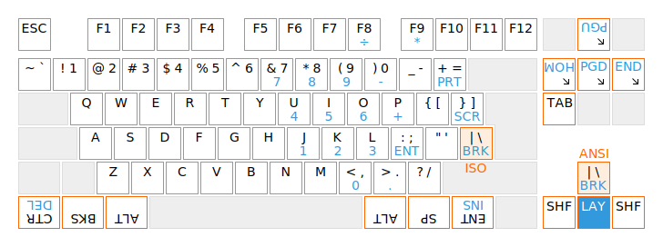

Chrumm keyboard
===============

Chrumm is an ergonomic keyboard prototype, influenced by
projects like the [Ergodox], [Redox], [Dactyl], and [Pteron].
For more information, check out the [build log].

Chrumm is provided without warranty of any kind.
It is your own responsibility to fulfill all
applicable health and safety requirements.

- Fixed-split
- Tented
- Columnar stagger
- Tilted thumb clusters
- Attached palm rests
- Decent dampening
- Reasonably standard layout
- Dedicated function row

[build log]: https://sev.dev/hardware/chrumm-again/
[Ergodox]: https://www.ergodox.io/
[Redox]: https://github.com/mattdibi/redox-keyboard
[Dactyl]: https://github.com/adereth/dactyl-keyboard
[Pteron]: https://github.com/FSund/pteron-keyboard

Electronics
-----------

The [firmware] is maintained in a separate repository.
The electronics are hand-wired. I mostly followed existing guides,
see the [QMK Hand-Wiring Guide] for a good overview. In particular,
I learned about the importance of the diodes from [Dave Dribin].
I used the following materials, based on availability,
affordability, and personal preference:

- 74x MX switch (Cherry MX Silent Red)
- 74x Diode, 1N4148
- Insulated solid wire, 0.5mm (24AWG), tinned copper
- Solder (Stannol Kristall 600, Sn96.5Ag3Cu0.5, REL0, 0.5mm)
- [Adafruit ItsyBitsy 32u4 5V 16MHz]
- USB cable, A to micro-B
- Zip ties, 2.5mm wide

[firmware]: https://github.com/sevmeyer/chrumm-firmware
[QMK Hand-Wiring Guide]: https://github.com/qmk/qmk_firmware/blob/master/docs/hand_wire.md
[Dave Dribin]: https://www.dribin.org/dave/keyboard/one_html/
[Adafruit ItsyBitsy 32u4 5V 16MHz]: https://www.adafruit.com/product/3677

Body
----

The body is made out of foam layers, sandwiched between painted
aluminium plates. The layers are manually cut and glued together.
The `tools` directory includes a Python script to slice the
STL model into layer stencils, which can be printed on paper.

- Laser-cut aluminium plates, 1.5mm
- Acrylic paint primer, suitable for aluminium
- Polyurethane acrylic paint
- EVA foam sheets (Rayher Crepla)
- Artificial leather for the palm rests
- Flexible glue (UHU Max Repair Universal)

Keys
----

For the thumb clusters, I recommend upside-down, 1.25u,
bottom-row caps from a cylindrical profile (Cherry, OEM).

The caps can be sourced from a single tenkeyless (TKL) set,
though not all of the standard labels will match,
and the layer key requires some improvisation.

