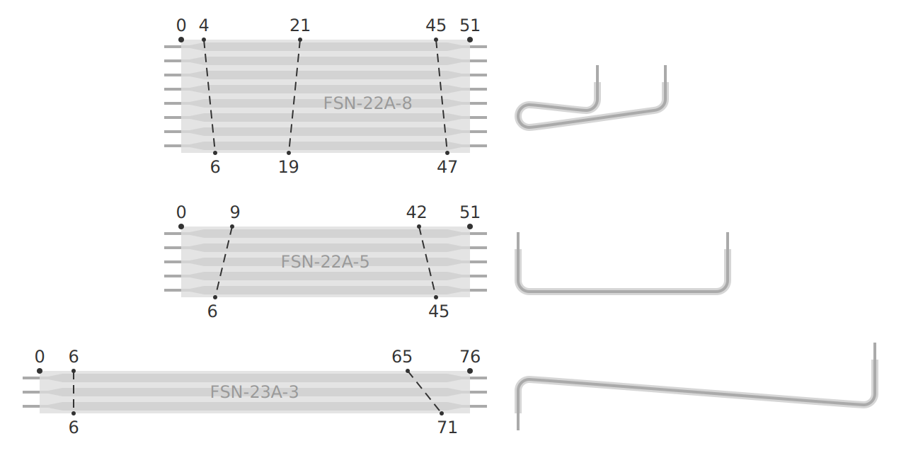

Chrumm keyboard PCB
===================

The PCB is made with [KiCad], version 7.

The PCB is reversible. It covers half of the keyboard,
and is flipped over for the other half. It is intended
to slightly bend between the pinky and ring finger,
therefore the board thickness should not exceed 0.8mm.

All connections are through-hole (or castelated), so
that they can be soldered with basic hobby equipment.
The switch pin holes are implemented as slots, to
provide a snug fit for the flat pins, and thus
minimize the required amount of solder.

A jig is provided to bend the diode legs uniformly.
Note that the gap between the PCB and the body is only
about 1mm. Therefore, the diodes are soldered on the
side facing away from the body. After soldering, the
legs are cut reasonably flush on the body-facing side.

[KiCad]: https://www.kicad.org/

Teardrops
---------

The teardrops are generated with a custom [KiCad plugin],
using the following settings:

    PTH arc radius: 250%
    SMD arc radius: 250%
    Via arc radius: 350%

[KiCad plugin]: https://github.com/sevmeyer/kicad-arc-teardrops

Production
----------

I ordered the prototypes from [PCBWay] (no affiliation).
Other manufacturers are available, check for example
[PCBShopper] or [Manufacturing Reports]. Here are some of
the relevant specifications, use them at your own discretion:

- Standard PCB (not flex)
- Single pieces (not panelized)
- Material: FR4 TG 150-160
- Thickness: 0.8mm (at most)
- Surface finish: HASL (lead free)
- Copper thickness: 1oz

[PCBWay]: https://pcbway.com/
[PCBShopper]: https://pcbshopper.com/
[Manufacturing Reports]: https://manufacturingreports.com/category/electronics/rigid-pcb-fabrication/

Interconnection
---------------

The PCB halves are connected via Flexstrip board-to-board jumpers.
To compensate for the split angle, the strips need to be folded in
a specific way before installation. Check the image for reference.
I wrapped them around a thin screwdriver shaft, to maintain a
minimum bend radius of about 2mm.

