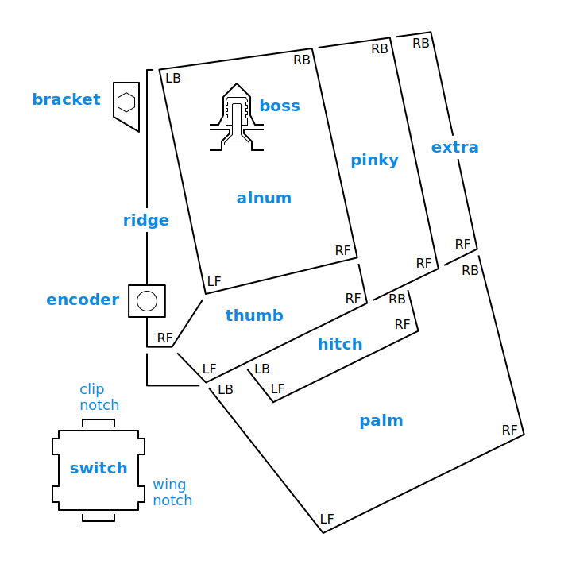
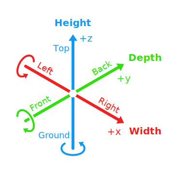

STL generator
=============

The STL files are generated with the `chrumm` package for Python 3.7+.
It has no dependencies and does not need to be compiled or installed.
Run it as a simple command-line tool from this directory:

    python3 -m chrumm --help

To generate the default split STL files:

    python3 -m chrumm --split chrumm.json

To generate one of the default encoder knob variants:

    python3 -m chrumm --knob chrumm.json variants/chrumm-knob-tight.json

Parameters
----------

The configuration parameters are provided via JSON files. If a
parameter appears multiple times, then its latest value is used.
Distances are given in millimeters, angles in degrees.

#### Limited parameter validation

The generator does not validate all the parameters.
Most importantly, chamfers and switch notches
are not taken into account when placing the walls.
Make sure that the switch margins provide enough room.

#### Body angles

The generator should produce reasonable results for
split, tent, and tilt angles up to about 30 degrees.
Results may vary for more extreme angles.

#### Layout

All layout parameters refer to the right half.

The `layout.fingerStagger` matrix represents the y-offset
of each key relative to its ortholinear position.
A key can be omitted by setting its value to `null`.

Each row is divided into three sublists. The first contains
the columns of the alnum section (index, middle, ring finger).
The second contains the pinky columns. The third contains
extra pinky columns that are added to the right half only.
All rows must have the same column structure.

The `layout.thumbCaps` list represents the thumb row from
left to right. Each sublist contains the width, depth,
and counter-clockwise rotation angle of a key cap.

The alnum, pinky, and thumb sections must each have
at least two columns.

#### Cap height

The `cap.height` parameter is used to maintain the cap pitch
across the tent crease. It is measured from plate to cap top.
The default value is the estimated average center height
of OEM caps (8mm) in their resting position (+6mm).

#### Disabling components

Chamfers can be turned off by setting them to `0`.
The value of the following parameters can be set
to `null` in order to omit them from the output:

    floor.hexHoles
    palm
    switch.clipNotch
    switch.wingNotch
    cable
    cable.hook
    bracket
    bracket.ziptieHole
    encoder
    encoder.pinNotch
    knob

Part names
----------

Orientation
-----------

I'm using the name "Ground" instead of "Bottom",
so that each name starts with a unique letter.
This allows for distinct abbreviations in code.
